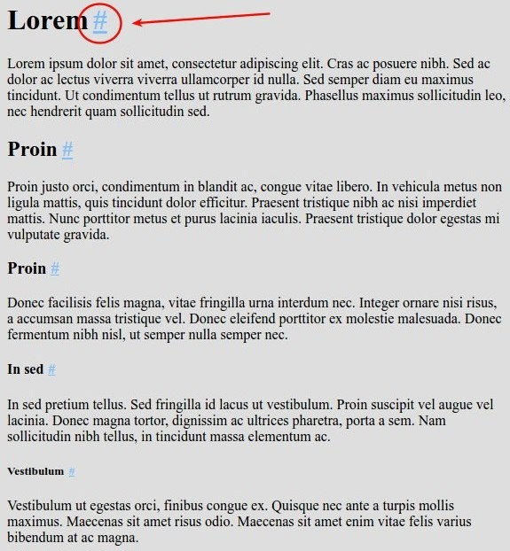

anchor-headings
===============

> Chrome Extension which adds missing anchors to headings

### Installation

https://chrome.google.com/webstore/detail/anchor-headings/lggjnoadjgfilclcmbakfkkfjjkhdpfo

### About

In long articles and tutorials each paragraph usually has it's own heading. Sometimes one wants copy a link to a particular paragraph, but not every website has such a link. This extension tries to solve the problem by adding an anchor link to each heading on a page in a form of "hash" sign `#` - you can either click on it and then copy complete URL from browser's address bar or use context menu to copy a link directly.

### How it looks

